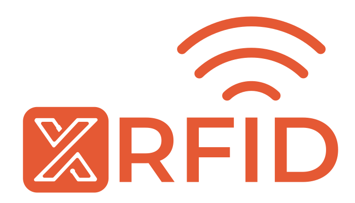

<!-- Improved compatibility of back to top link: See: https://github.com/othneildrew/Best-README-Template/pull/73 -->
<a name="readme-top"></a>

<!-- PROJECT SHIELDS -->
[![Contributors][contributors-shield]][contributors-url]
[![Forks][forks-shield]][forks-url]
[![Stargazers][stars-shield]][stars-url]
[![Issues][issues-shield]][issues-url]
[![MIT License][license-shield]][license-url]
[![LinkedIn][linkedin-shield]][linkedin-url]

<!-- PROJECT LOGO -->
<br />
<div align="center">
  <a href="https://github.com/XerumSrl/XRFID-Demo">
    
  </a>

<h3 align="center">XRFID</h3>

  <p align="center">
    <!-- <a href="https://github.com/XerumSrl/XRFID-Demo">View Demo</a>
    · -->
    <a href="https://github.com/XerumSrl/XRFID-Demo/issues">Report Bug</a>
    ·
    <a href="https://github.com/XerumSrl/XRFID-Demo/issues">Request Feature</a>
  </p>
</div>


<!-- TABLE OF CONTENTS -->
<details>
  <summary>Table of Contents</summary>
  <ol>
    <li>
      <a href="#about-the-project">About The Project</a>
      <ul>
        <li><a href="#built-with">Built With</a></li>
      </ul>
    </li>
    <li>
      <a href="#getting-started">Getting Started</a>
      <ul>
        <li><a href="#prerequisites">Prerequisites</a></li>
        <li><a href="#build-and-deploy">Build</a></li>
        <li><a href="#connect-application">Deploy</a></li>
      </ul>
    </li>
    <li><a href="#usage">Usage</a></li>
    <li><a href="#roadmap">Roadmap</a></li>
    <li><a href="#contributing">Contributing</a></li>
    <li><a href="#license">License</a></li>
  </ol>
</details>


<!-- ABOUT THE PROJECT -->
## About The Project

The Android application is designed to provide a sample of the RFID capabilities of Zebra mobile devices.
the server manages Fixed readers trough MQTT, printers and the data needed to pilot a full RFID workflow from Printig an RFID label to reading RFID tags

<p align="right">(<a href="#readme-top">back to top</a>)</p>


### Built With

* [![dotnet-badge]][dotnet-url]
* [![MAUI-badge]][MAUI-url]
* [![zebra-MAUI-badge]][Zebra-MAUI-url]
* [![SF-badge]][SF-url]
* [![MudBlazor-badge]][MudBlazor-url]
* [![MQTTNet-badge]][MQTTNet-url]

<p align="right">(<a href="#readme-top">back to top</a>)</p>


<!-- GETTING STARTED -->
## Getting Started

note: the android application cannot be deployed to Device Emulator or any non-Zebra devices, any device not mentioned in the Prerequisites section has not been tested and it is not guaranteed to work

### Prerequisites
* PowerShell 7 (only if you want to set up the server as a service)
* Open ports 5098 and 7098 and/or forward them on the machine that is going to host the server
* One of the following Zebra devices:
  * MC33x RFID
  * TC2x + RFD40
  * TC5x + RFD40
  * TC7x + RFD90
* Visual Studio 2022 17.7 or later with the following workloads intalled:
  * ASP.NET and web development
  * .NET Multi-Platform App UI development
* A syncfusion License Key, [here](https://support.syncfusion.com/kb/article/9795/how-to-get-community-license-and-install-it) is a guide to get a free SyncFusion Community license key 

### Build and deploy
 
0. Clone the repo
    ```sh
    git clone https://github.com/XerumSrl/XRFID-Demo.git
    ```
#### Android Apllication
1. Have your Device ready with ADB enabled
2. Get a SyncFusion Community license key
3. Open the Solution (If needed Authorize your PC on the ADB Prompt on the device)
4. add your SyncFusion key in
    ```
    XRFID.Client.Mobile/App.xaml.cs at
    .RegisterLicense("your_syncfusion_license");
    ```
5. Build XRFID.Demo.Client.Mobile
6. Deploy to device

#### Server
1. Build XRFID.Demo.Server
2. Publish XRFID.Demo.Server
3. Go to the publish folder
4. Recommended: edit appsettings.json as you see fit (I recommend checking the Logfile output path)
5. Optional: open Powershell 7 and execute this command to add the se server as a service (replace paths as needed):
    ```
    New-Service -Name XRFID.Demo.Server -BinaryPathName "{Path to publish folder}\XRFID.Demo.Server.exe --contentRoot C:\{Path to publish folder}" -Description "XRFID Demo Server" -DisplayName "XRFID Demo Server" -StartupType AutomaticDelayedStart
    ```
### Connect Application 

1. Start XRFID.Demo.Server (either as a service or by exectuing it directly)
3. Start Application on device
4. Go to setting and note down DeviceId and name (name can be changed to any valid hostname string)
5. in the API Enpoint field put the url wher the server is hosted
5. On your PC open a browser and go to [http://localhost:5098/swagger](http://localhost:5098/swagger)
6. Go to Reader/Minimal post and add a reader with the Id and name you noted down.

<p align="right">(<a href="#readme-top">back to top</a>)</p>


<!-- USAGE EXAMPLES -->
## Usage

This application can be used to look for RFID tags and pinpoint an RFID tag location and.
the application can also scan a Barcode that can be used (with an appropriately configured backend) to get a collection of RFID tags and subsequently verify if they are present.

<p align="right">(<a href="#readme-top">back to top</a>)</p>


<!-- ROADMAP -->
## Roadmap

- [x] Easier device (reader) enrollment
- [ ] Authenticated APIs
- [x] UI to Add data and devices to the backend

See the [open issues](https://github.com/XerumSrl/XRFID-Demo/issues) for a full list of proposed features (and known issues).

<p align="right">(<a href="#readme-top">back to top</a>)</p>


<!-- CONTRIBUTING -->
## Contributing

Contributions are what make the open source community such an amazing place to learn, inspire, and create. Any contributions you make are **greatly appreciated**.

If you have a suggestion that would make this better, please fork the repo and create a pull request. You can also simply open an issue with the tag "enhancement".
Don't forget to give the project a star! Thanks again!

1. Fork the project
2. Create your feature branch (`git checkout -b amazing-feature`)
3. Commit your changes (`git commit -m 'feat: Add some AmazingFeature'`)
4. Push to the branch (`git push origin amazing-feature`)
5. Open a Pull Request

<p align="right">(<a href="#readme-top">back to top</a>)</p>


<!-- LICENSE -->
## License

Distributed under the MIT License. See `LICENSE.txt` for more information.

<p align="right">(<a href="#readme-top">back to top</a>)</p>

<!-- ACKNOWLEDGMENTS -->
## Acknowledgments

* [MAUI EMDK sample](https://github.com/ZebraDevs/emdkMAUIapp)

<p align="right">(<a href="#readme-top">back to top</a>)</p>


<!-- MARKDOWN LINKS & IMAGES -->
<!-- https://www.markdownguide.org/basic-syntax/#reference-style-links -->
[contributors-shield]: https://img.shields.io/github/contributors/XerumSrl/XRFID-Demo.svg?style=for-the-badge
[contributors-url]: https://github.com/XerumSrl/XRFID-Demo/graphs/contributors
[forks-shield]: https://img.shields.io/github/forks/XerumSrl/XRFID-Demo.svg?style=for-the-badge
[forks-url]: https://github.com/XerumSrl/XRFID-Demo/network/members
[stars-shield]: https://img.shields.io/github/stars/XerumSrl/XRFID-Demo.svg?style=for-the-badge
[stars-url]: https://github.com/XerumSrl/XRFID-Demo/stargazers
[issues-shield]: https://img.shields.io/github/issues/XerumSrl/XRFID-Demo.svg?style=for-the-badge
[issues-url]: https://github.com/XerumSrl/XRFID-Demo/issues
[license-shield]: https://img.shields.io/github/license/XerumSrl/XRFID-Demo.svg?style=for-the-badge
[license-url]: https://github.com/XerumSrl/XRFID-Demo/blob/master/LICENSE.txt
[linkedin-shield]: https://img.shields.io/badge/-LinkedIn-black.svg?style=for-the-badge&logo=linkedin&colorB=555
[linkedin-url]: https://it.linkedin.com/company/xholding
[product-screenshot]: images/screenshot.png
[MAUI-badge]: https://img.shields.io/badge/.NET%20MAUI-AC99EA
[MAUI-url]: https://dotnet.microsoft.com/en-us/apps/maui
[SF-badge]: https://img.shields.io/badge/SyncFusion%20MAUI--F6921E?labelColor=2B357C
[SF-url]: https://www.syncfusion.com/maui-controls
[Zebra-MAUI-badge]: https://img.shields.io/badge/Zebra%20EMDK%20MAUI-FFFFFF
[Zebra-MAUI-url]: https://developer.zebra.com/blog/developing-net-maui-zebra-androidtm-devices
[dotnet-badge]: https://img.shields.io/badge/.NET%20Core%207-512bd4
[dotnet-url]: https://dotnet.microsoft.com/en-us/
[MudBlazor-badge]: https://img.shields.io/badge/MudBlazor-6253E9
[MudBlazor-url]: https://mudblazor.com/
[MQTTNet-badge]: https://img.shields.io/badge/MQTTNet-A30000
[MQTTNet-url]: https://github.com/dotnet/MQTTnet
